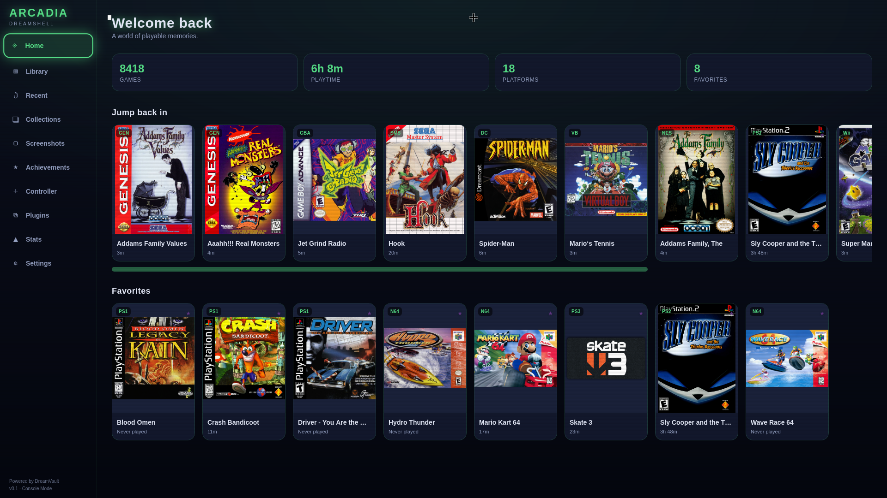
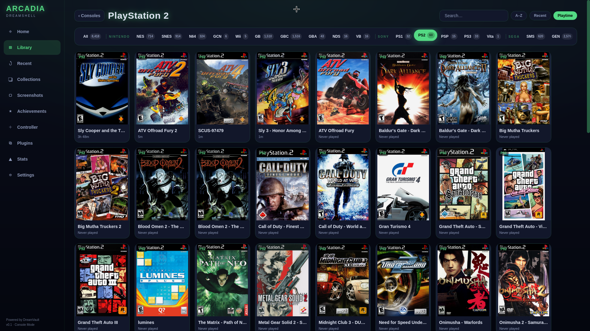
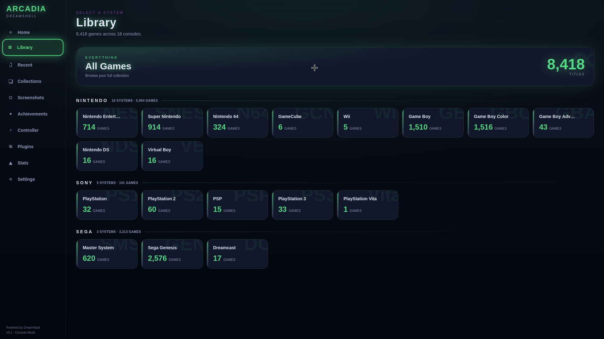
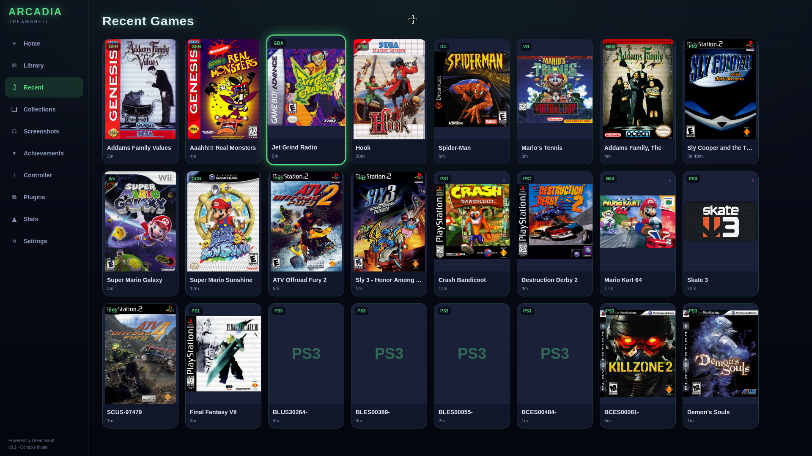
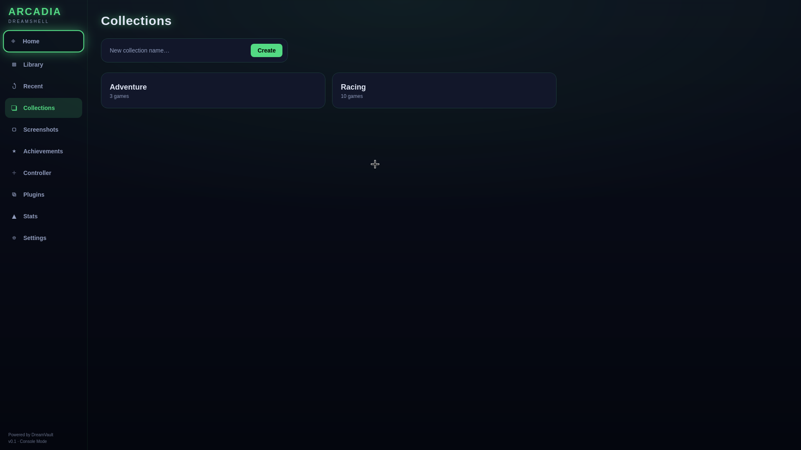

# Arcadia

### Dreamshell Interface · *Linux-native emulation ecosystem*

> A Linux-native emulation ecosystem that unifies your ROM libraries, emulators, saves,
> metadata, and achievements into one cohesive experience. Arcadia is the **conductor, not
> the orchestra** — it never replaces your emulators, it **orchestrates** them.
> *A world of playable memories, unified.*

`Tauri + Rust + SQLite` · **v0.1.0** · **[ALPHA · IN ACTIVE DEVELOPMENT]**



---

## The Prime Directive

Arcadia is not another emulator. It is a unified management layer that sits *above* your
emulators, package managers, controllers, and save systems — respecting the Linux tooling you
already use instead of fighting it.

- **We never own the emulator.** Arcadia orchestrates existing systems — discovery, launching,
  indexing, sync, visualization. Emulation, save formats, and drivers stay with the tools that
  already do them well.
- **Linux is the platform.** Respects pacman, yay, Flatpak, and AppImage ownership. If a package
  manager installed it, that manager owns updates — Arcadia only informs, never silently escalates.
- **Discover, don't reimplement.** Saves and savestates are discovered in place and shown uniformly
  across every emulator. Files are backed up and versioned — never parsed, rewritten, or lost to
  last-writer-wins.
- **Adapter layer.** Every emulator gets a native Rust adapter that reports capabilities instead of
  assuming them. Unsupported features simply hide themselves in the interface.

---

## Interface Modes

One front end — **Dreamshell** — three modes. Console and Deck share a layout engine; Studio is the
desktop power surface. Every screen is operable by mouse, keyboard, controller, and touch.

- **Console Mode** — Controller-first fullscreen couch experience. Dreamcast-inspired — think Steam
  Big Picture for emulation.
- **Studio Mode** — Desktop power-user management for library, metadata, saves, registry, plugins,
  and themes. Steam + Plex + VSCode.
- **Deck Mode** — A 1280×800 Steam Deck profile of Console Mode — not separate code. Power, suspend,
  and overlay aware.

### DreamVault Engine — the truth layer

ROM Index & Library Graph · Save & State Discovery · Metadata Graph · Emulator Registry · Sync Layer

---

## Screenshots

| Console library | Landing |
| --- | --- |
|  |  |

| Recent | Collections |
| --- | --- |
|  |  |

---

## Supported Emulators

Adapters span one libretro frontend plus a roster of standalone emulators — covering 2D retro
through current-gen emulation. Bring your own installs from pacman, Flatpak, or AppImage; Arcadia
detects and orchestrates them.

`RetroArch` · `Dolphin` · `PCSX2` · `PPSSPP` · `RPCS3` · `DuckStation` · `Mupen64Plus` · `SNES9x` ·
`mGBA` · `melonDS` · `MAME` *(soon)*

---

## Installation

Prebuilt binaries are attached to each [GitHub release](https://github.com/Evol-Luci/arcadia/releases).
Arcadia links `webkit2gtk-4.1` and `gtk3` — make sure those are installed.

### AppImage (any distro)

```sh
chmod +x arcadia_0.1.0_amd64.AppImage
./arcadia_0.1.0_amd64.AppImage
```

To add it to your applications menu, run the included integration script:

```sh
./install.sh        # installs the AppImage + desktop entry + icon
./install.sh --uninstall
```

### Debian / Ubuntu

```sh
sudo apt install ./arcadia_0.1.0_amd64.deb
```

### Fedora / RHEL

```sh
sudo dnf install ./arcadia-0.1.0-1.x86_64.rpm
```

### Arch / AUR (from source)

```sh
makepkg -si        # from the packaging/ PKGBUILD
```

### Flatpak

```sh
flatpak install ./org.arcadia.dreamshell.flatpak
flatpak run org.arcadia.dreamshell
```

> **Note:** the Flatpak build is currently second-class. Because Arcadia launches *host-installed*
> emulators, the sandboxed build needs a `flatpak-spawn --host` shim that is not yet implemented —
> prefer the AppImage, deb, rpm, or AUR builds for now.

---

## The Arcadia Guarantee

**100% local. DRM-free. Open source.** Arcadia indexes the files you already have. It never bundles,
downloads, or distributes ROMs or BIOS — and it never phones home.

- **Index only** — Arcadia points at your existing ROM and save folders and reads them in place.
  Your files are never moved or rewritten.
- **Opt-in telemetry** — Analytics are off by default and clearly disclosed. We don't track your
  playtime, your deaths, or your hardware.
- **Respects your system** — XDG Base Directory compliant. Package operations are shown, confirmed,
  and escalated via polkit — never a silent sudo.
- **Yours to keep** — Offline-first, DRM-free, and GPL-friendly. Built for the Linux crowd, on
  Linux's terms.

---

## Technical Specifications

| | |
| --- | --- |
| **Engine** | DreamVault — Rust core |
| **Interface** | Dreamshell — Tauri + React + TypeScript |
| **Database** | SQLite via SQLx |
| **Plugins** | WASM (sandboxed, data-only roles) |
| **Theme engine** | DreamGlass · Afterglow · Arcadia Green |
| **Packaging** | AppImage · deb · rpm · AUR · Flatpak |
| **OS support** | Linux desktop · Steam Deck |

---

## License

GPL-3.0-or-later.

*Evol Digital Productions · Est. 2026 · We never own the emulator.*
